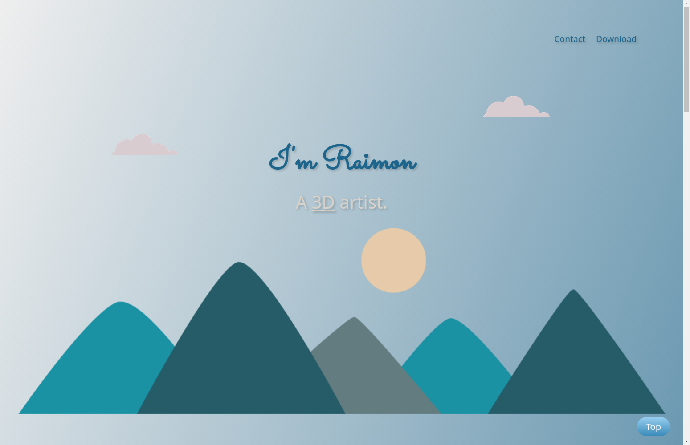

# Personal Site

Welcome to my personal portfolio website! You can visit the live site at: [https://raimonvibe.github.io/personal-site/](https://raimonvibe.github.io/personal-site/)

## About Me

I'm Raimon, a passionate 3D artist and software developer. I combine creativity with technical expertise to deliver high-quality solutions in both 3D design and web development.

### 3D Design & Modeling
- Proficient in CAD software including Blender, Meshmixer, and TinkerCad
- Created over 500 free 3D models available for download
- Specialized in practical and artistic 3D modeling
- Expert in 3D printing and model optimization

### Software Development
- Front-End Development specialist using HTML5 and CSS3
- Programming experience in JavaScript and Python
- Custom website development
- Computer quiz applications development in Python

## Portfolio & Services

You can find my work and services on various platforms:

- 🎨 [3D Models on Cults3D](https://cults3d.com/en/users/raimonvibe/3d-models) - Browse my collection of 3D models
- ✍️ [Medium Blog](https://medium.com/@raimonvibe) - Articles about coding bootcamps and 3D printing

## Contact

For business inquiries or feedback, feel free to reach out:
- 📧 Email: [info@raimoncoding.nl](mailto:info@raimonvibe.com)

## License

© 2024 www.raimonvibe.com
